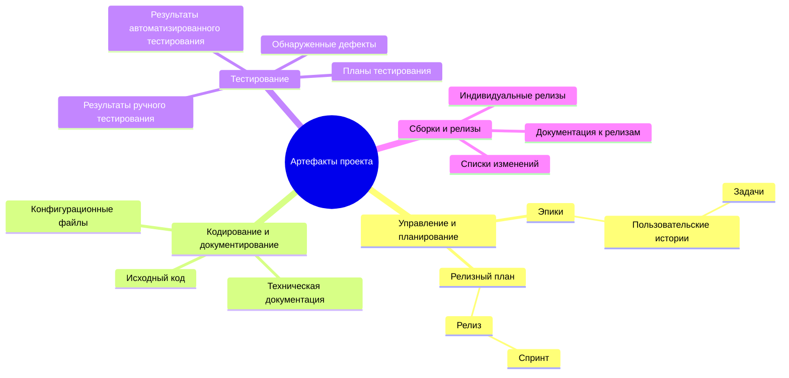
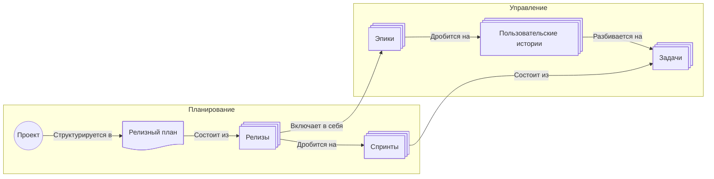

# 4. Артефакты проекта, их иерархии, методики использования

> Описание результатов продуктов деятельности различных ролей, которые описаны в пункте 3. Жекомпозиция артефактов. Декомпозиция задач от эпиков до ТЗ, структура отчетности, структура результатов (версионирование, сборки, части системы).
>
> Артефакты: 
> - индивидуальные релизы
> - результаты тестирования
> - баги
> - и любая другая сущность выпущенная в рамках реализации проекта, которая имеет ценность в рамкках ретроспективного анализа
> 
> Артефакты должны соответсвовать с планирование в пункте 3. Не должно появиться новых артефактов 

## 4.1 Общая структура артефактов

В контексте разработки системы мониторинга ресурсов артефакты представляют собой результаты деятельности различных ролей, структурированные в соответствии с иерархией задач. Система артефактов обеспечивает полную прозрачность проекта и возможность ретроспективного анализа всех решений, принятых во время разработки.

В проекте выделенны следующие артефакты:
- Артефакты управления и планирования
- Артефакты кодирования и документирования
- Артефакты тестирования
- Артефакты сборок и релизов



## 4.2 Артефакты управления и планирования

В проекте используется следующая иерархия артефактов управления и планирования:


### 4.2.1 Релизный план
Релизный план формируется стейкхолдерами и владельцем проекта. При создании проекта формируется план из 2-3 релизов - на этом этапе формируется MVP, который удовлетворить стейкхолдеров в кратчайшие сроки разработки. Содержание дальнейших релизов определяется по ходу разработки продукта.

Релизный план должен содержать:
   - Планируемые даты и содержимое релизов
   - Критерии готовности к выпуску релизов (Definition of Done)

### 4.2.2 Релиз
Релиз - упаковка продукта, готового к развертыванию в среде заказчика, которая поставляется раз в 2 месяца. Содержание релиза определяет владелец продукта с главным архитектором. Релиз состоит из выполненных эпиков, количество которых зависит от их трудоемкости и распределения по спринтам.

### 4.2.3 Спринт
Содержания спринта определяется на встречах, в которых участвуют архитектор проекта, scrum master и разработчики. Каждый спринт должен содержать в себе:
   - Список историй и задач, выбранных для текущего спринта
   - Оценки в story points
   - Статус каждого элемента (Бэклог, В работе, Валидация, Готово)

### 4.2.4 Эпик
**Эпики** — наиболее крупные единицы работы, представляющие большие функциональные блоки системы мониторинга. Примеры эпиков:
- Эпик 1: "Сбор и агрегация метрик из различных источников"
- Эпик 2: "Визуализация и аналитика данных мониторинга"
- Эпик 3: "Оповещение и управление инцидентами"

### 4.2.5 Пользователтская история

Каждый эпик декомпозируется на истории пользователя, описывающие конкретные функции с точки зрения конечного пользователя:

**Пример декомпозиции Эпика 1 — "Сбор и агрегация метрик":**

- US-001: "Как администратор IT-инфраструктуры, я хочу настроить автоматический сбор метрик CPU/RAM/Disk с серверов, чтобы получать актуальные данные в режиме реального времени"
- US-002: "Как оператор мониторинга, я хочу получать метрики из контейнеризированных приложений (Kubernetes), чтобы отслеживать состояние микросервисов"
- US-003: "Как аналитик, я хочу импортировать данные из внешних систем (Prometheus, Grafana), чтобы интегрировать их в единый дашборд"

### 4.2.6 Задача

Каждая история пользователя разбивается на конкретные задачи (обычно на этапе планирования спринта):

**Пример декомпозиции US-001:**

- TASK-001-1: "Разработать агент сбора метрик для Linux-серверов (Prometheus exporter)"
- TASK-001-2: "Интегрировать агент с API системы мониторинга"
- TASK-001-3: "Написать unit-тесты для агента сбора"
   
### 4.2.7 Жизненный цикл артефактов планирования

1. **Создание**: Артефакты создаются в соответствии с выполнением задач и историй
   - Исходный код пишется в ветке feature
   - Тесты создаются одновременно или перед кодом (TDD подход)
   - Документация обновляется при изменении функциональности

2. **Рецензирование**: Перед включением в основную ветку
   - Code Review обязателен (минимум 2 рецензента для критических компонентов)
   - Проверка покрытия тестами
   - Проверка соответствия семантичнским стандартам кодирования

3. **Интеграция**: Слияние в основную ветку разработки
   - Статический анализ кода
   - Автоматическое запускание CI/CD пайпайна
   - Прогон всех автоматизированных тестов
   - Публикация артефактов (Docker образы, библиотеки)

4. **Архивирование**: Сохранение для истории
   - Все релизы сохраняются с указанием версии
   - Возможность быстрого доступа к любой версии из истории

## 4.3 Артефакты кодирования и документирования

1. **Исходный код**
   - Компоненты микросервисов (API сервер мониторинга, агенты сбора, обработчик уведомлений)
   - Версионирование в системе контроля версий (Git)

2. **Техническая документация**
   - API документация (OpenAPI/Swagger)
   - Architecture Decision Records (ADR)
   - Runbooks для операционной поддержки
   - README файлы для каждого компонента

3. **Конфигурационные файлы**
   - Docker Compose файлы для локальной разработки
   - Kubernetes манифесты для продакшена
   - Terraform/Ansible скрипты для инфраструктуры
   - Примеры конфигов для различных окружений (dev, staging, prod)

## 4.4 Артефакты тестирования

1. **Планы тестирования (Test Plans)**
   - Задокументированные подходы к тестированию каждой истории
   - Checklist критических путей в системе

2. **Результаты автоматизированного тестирования (Automated Test Results)**
   
   Проект должен включать в себя:
   - Unit тесты
   - Integration тесты для API endpoints
   - E2E тесты критических сценариев мониторинга

3. **Результаты ручного тестирования (Manual Test Results)**
   - Отчеты тестировщиков о проведенном функциональном тестировании
   - Результаты тестирования на различных браузерах и ОС
   - Результаты нагрузочного тестирования (load testing, stress testing)

4. **Артефакты по обнаруженным дефектам (баги)**
   - Регистрируемые дефекты с описанием шагов воспроизведения
   - Скриншоты и логи ошибок
   - Трассировка стека вызовов (stack traces)
   - Уровень критичности: Critical, High, Medium, Low

## 4.5 Артефакты сборок и релизов

1. **Артефакты сборки (Build Artifacts)**
   - Docker образы компонентов системы
   - JAR/WAR файлы бэкэнд приложения (если используется Java)
   - Минифицированный JavaScript и CSS для фронтэнда
   - Бинарные файлы агентов сбора для различных ОС

2. **Версионированные релизы (Release Artifacts)**
   - Changelog с описанием изменений
   - Migrationguides для обновления системы на новую версию
   - Release notes с описанием новых функций

Каждый артефакт должен быть связан с:
- Задачей/историей, которая его породила
- Коммитом в Git, содержащим изменения
- Тестовым слейсом, который его проверяет
- Версией релиза, в который он вошел

**Пример трейсирования:**
```
Эпик 1 → US-001 → TASK-001-3 → Commit: abc1234 
→ Test Suite: test_cache_resilience 
→ Build: monitoring-app-v1.2.0 
→ Deployed to: staging → Deployed to: production
```

## 4.6 Артефакты деплоймента

1. **Deployment Checklist**
   - Последовательность действий для развертывания релиза
   - Проверки безопасности и здоровья системы

2. **Infrastructure as Code (IaC)**
   - Terraform конфигурации для создания облачной инфраструктуры
   - Ansible playbooks для настройки серверов

3. **Логи деплоймента**
   - Запись о времени деплоймента
   - Стадии прохождения (pre-deployment checks, deployment, post-deployment validation)
   - Возможность rollback

## 4.7 Организация хранилища артефактов

**Структура репозитория:**
```
/monitoring-system
├── /backend
│   ├── /src (исходный код)
│   ├── /tests (тесты)
│   ├── /docs (документация компонента)
│   └── Dockerfile
├── /agents
│   ├── /linux-agent
│   ├── /windows-agent
│   └── /kubernetes-exporter
├── /frontend
│   ├── /src
│   ├── /tests
│   └── package.json
├── /infrastructure
│   ├── /terraform
│   ├── /ansible
│   └── /k8s-manifests
├── /documentation
│   ├── /api (OpenAPI спецификация)
│   ├── /architecture (ADR)
│   ├── /runbooks
│   └── /deployment-guides
├── .github/workflows (CI/CD конфигурация)
└── CHANGELOG.md
```

## 4.8 Контроль качества артефактов

**Definition of Done для каждого типа артефакта:**

1. **Исходный код и задачи тестирования**:
   - Код соответствует стандартам проекта
   - Покрытие кода тестами в соответсвии с реграментом тестирования
   - Пройдена статический анализ кода
   - Нет критических уязвимостей безопасности
   - Code Review пройдена положительно

3. **Документация**:
   - Актуальна относительно кода
   - Содержит примеры использования
   - Отформатирована корректно
   - Проверена редактором

4. **Выпуск**:
   - Все выделенные в релизном плане функции венедрены
   - Все баги критичного уровня исправлены
   - Подготовлен список изменений
   - Подготовлены инструкции к миграции (если требуется)

