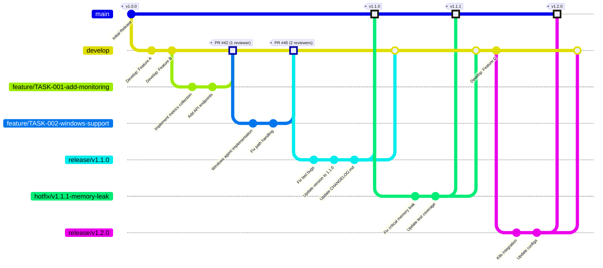

# 5. Управление структурой версий проекта, иерархией веток, правила, методики слияния и формирования номеров релизов и веток

> Управление выпускаемыми артефактами в соответсвии с выведенной структурой управления проектом. Способ управления версиями.

## 5.1 Стратегия управления версиями

Для системы мониторинга ресурсов используется Git Flow модель.

## 5.2 Структура веток



### 5.2.1 Основные ветки 

1. **main**

    Ветка main является релизной и может содержать в себе только код, готовый к продакшену. В ветке main можно выполнять слияние только с ветками release, каждое слияние ветки означает выпуск нового релиза и фиксируется тегом. Доступ к ветке защищен, слиянием управляет лидер разработки. 

2. **develop**

    Ветка develop является местом подготовки следующего релиза. В ветке develop можно выполнять слияние только с ветоками feature/* и release/*. Доступ к ветке защищен, каждое объединение ветки требует ревью кода с участием минимум 1 рецензента.  

### 5.2.2 Вспомогательные ветки

1. **feature/***

    Ветки feature/* предназначены для разработки нового функционала в соответствии с поставленной задачей. Ветки feature создаются из ветки develop и именуются в формате `feature/TASK-001-description-in-kebab-case` (название ветки обазательно должно отсылать к номеру задачи). После завершения разработки ветки сливаются с develop и удаляются.
   
   - Жизненный цикл ветки feature/*:
     1. Создание ветки для реализации дизненного цикла
     2. Разработка и коммиты
     3. Push в удаленный репозиторий
     4. Открытие Pull Request в develop
     5. Code Review и обсуждение
     7. Слияние в develop и удаление ветки
   
   - Правила слияния:
     - Минимум 1 Code Review от другого разработчика
     - Все CI/CD тесты должны пройти
     - Нет конфликтов с develop веткой

2. **release/***

    Ветки release/* создаются из ветки develop/* и предназначены для фиксации итогов спринта и подготовки разработанного функционала к выпуску. В ветки release/* нельзя добавлять новый функционал. Подготовка релиза включает в себя:     
     - Исправление последних багов
     - Обновление версионных номеров в коде и конфигах
     - Обновление CHANGELOG.md
     - Финальное тестирование 

   Наименование ветки должно соответсвовать схеме номерирования версий. По окончании работ ветка сливается с main и develop и удаляется.

3. **hotfix/***

    Ветки hotfix/* создаются из ветки main для исправления критических неисправностей в продакшене с наименованим в формате `hotfix/v1.2.1-description`. По окончании работ ветка сливается c develop и main. На ветке main создается новый тег в соответствии со схемой номерования версий.

## 5.3 Конвенции именования коммитов

Для лучшей трейсируемости используется **Conventional Commits**:
- `feat`: Новая функция
- `fix`: Исправление бага
- `docs`: Изменения в документации
- `style`: Форматирование кода (не влияет на логику)
- `refactor`: Рефакторинг кода без изменения функциональности
- `perf`: Оптимизация производительности
- `test`: Добавление или обновление тестов
- `chore`: Изменения в build процессе, зависимостях, и т.д.

## 5.4 Схема номерирования версий

Используется **Semantic Versioning 2.0.0** формат: `MAJOR.MINOR.PATCH[-PRERELEASE][+METADATA]`

**Структура номера версии:**

- **MAJOR**: Изменение архитектуры, несовместимые изменения API, крупные функции
  - Пример: `2.0.0` — переход на новую архитектуру микросервисов
  
- **MINOR**: Новые функции, совместимые с предыдущей версией
  - Пример: `1.5.0` — добавление поддержки Kubernetes метрик
  
- **PATCH**: Исправления багов, улучшения производительности
  - Пример: `1.4.3` — исправление утечки памяти
- **Pre-release**:
    - `1.5.0-alpha.1` — ранняя версия для внутреннего тестирования
    - `1.5.0-beta.2` — бета версия для ограниченного круга тестировщиков
    - `1.5.0-rc.1` — release candidate, финальное тестирование

## 5.6 Процесс управления слияниями

### 5.5.1 Code Review процесс

**Шаги процесса:**

1. **Подготовка Pull Request**
   - Разработчик создает PR из feature ветки в develop (или release/main для hotfix)
   - Заполняет шаблон PR с описанием:
     - Связанная задача/issue
     - Описание изменений

    Пример шаблона PR:
    ```markdown
    ## Описание
    Внедрение агента сбора метрик Prometheus на сервера Linux
    
    ## Связанные задачи
    Закрывает #MON-001
    
    ## Изменения
    - Добавил экспортер prometheus в систему мониторинга
    - Добавил схему конфигурации агента
    - Внедрил улучшенную группировку получаемых от агента данных
    ```

2. **Автоматизированные проверки (CI/CD)**
   - Запускаются все unit тесты
   - Запускается статический анализ кода (SonarQube, ESLint, etc.)
   - Проверяется покрытие кода тестами
   - Проверяется наличие security уязвимостей (SAST)
   - Проверяется форматирование кода

3. **Ручная рецензия (Code Review)**
   - Минимум 1 разработчик (для некритичных)
   - Минимум 2 разработчика (для критичных компонентов)
   - Рецензент проверяет:
     - Логика решения
     - Соответствие требованиям в User Story
     - Читаемость и поддерживаемость кода
     - Отсутствие дублирования
     - Соответствие архитектуре

4. **Утверждение и слияние**
   - После утверждения PR может быть merged
   - Требуется "Squash and merge" для feature веток
   - Ветка автоматически удаляется после merge

### 5.5.2 Слияние release-candidate ветки

В main ветку:
```bash
git checkout main
git merge --no-ff release-candidate/v1.1.0 -m "Merge release-candidate/v1.1.0 to main"
git tag -a v1.1.0.4512 -m "Release version 1.1.0.4512"
git push origin main
git push origin v1.1.0.4512
```

 В develop ветку (для сохранения исправлений):
```bash
git checkout develop
git merge --no-ff release-candidate/v1.1.0 -m "Merge release-candidate/v1.1.0 to develop"
git push origin develop
```

Требования к слиянию:
- Обязательная ассоциация слияния с задачей на мерж в трекере
- Комментарий к слиянию в формате: "Merge from release-candidate/v1.1.0 to main"
- Минимум 2 утверждающих ревьюера для основных релизов
- Все тесты в CI/CD должны пройти успешно
- Code quality gate должен быть пройден (SonarQube)
- При слиянии баз данных использования SNAP-файлов с проверкой на целевой БД


### 5.5.2 Конфликты при слиянии

**Процедура разрешения:**
- Разработчик, создавший PR, ответственен за разрешение конфликтов
- Необходимо перебазировать (rebase) и разрешить конфликты локально
- После разрешения — force push в ветку PR
- После разрешения конфликтов требуется повторное утверждение Code Review

```bash
# Процесс разрешения конфликтов
git fetch origin
git rebase origin/develop
# Разрешаем конфликты в файлах
git add .
git rebase --continue
git push -f origin feature/MON-001-description
```

## 5.7 Версионирование артефактов релиза

Каждый артефакт включает:
- **Версия**: Совпадает с версией релиза (1.2.0)
- **Build number**: Уникальный номер сборки (CI/CD job номер)
- **Git commit hash**: SHA-1 хеш коммита, который был собран
- **Timestamp**: Время создания артефакта
- **Signature**: Криптографическая подпись для проверки подлинности

**Пример тэга Docker образа:**
```
monitoring-api:1.2.0
monitoring-api:1.2.0-build.456
monitoring-api:1.2.0-sha-abc1234
monitoring-api:latest (указывает на последний стабильный)
monitoring-api:v1.2.x-latest (последний в линии 1.2)
```
