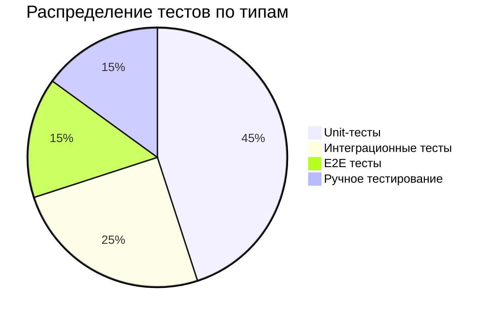
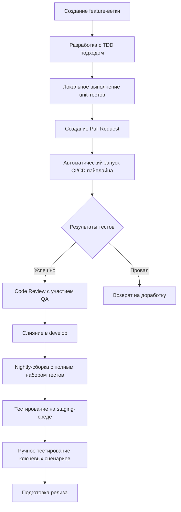
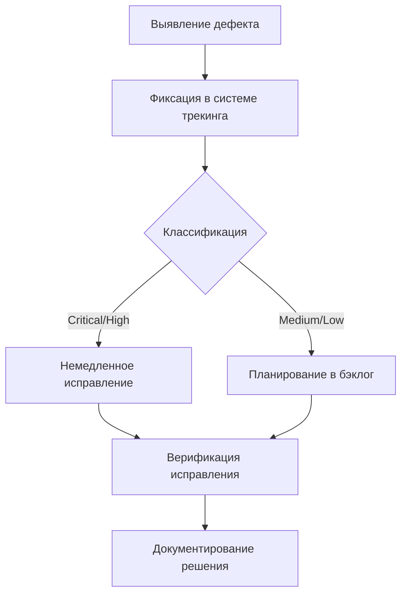

# Процессы интеграции автоматизированного и ручного тестирования

## 1. Общие принципы интеграции тестирования

### 1.1 Цели и задачи
- **Обеспечение качества**: Комплексный подход к выявлению дефектов на всех этапах жизненного цикла разработки
- **Сокращение времени**: Автоматизация рутинных проверок для ускорения процесса тестирования
- **Снижение рисков**: Ручное тестирование критически важных бизнес-сценариев
- **Трейсирование**: Полное соответствие артефактов тестирования иерархии задач от эпиков до конкретных задач

### 1.2 Классификация тестов

## 2. Стратегия тестирования

### 2.1 Автоматизированное тестирование

#### Уровни автоматизации:
- **Unit-тесты** (покрытие кода ≥ 70%):
  - Проверка отдельных функций и методов
  - Изоляция компонентов с использованием mock-объектов
  - Запуск при каждом коммите в CI/CD pipeline
  
- **Интеграционные тесты**:
  - Проверка взаимодействия компонентов системы
  - Тестирование API endpoints
  - Проверка интеграции с внешними системами
  
- **E2E тесты** (End-to-End):
  - Автоматизация критических пользовательских сценариев
  - Проверка полного пути выполнения бизнес-требований
  - Запуск перед каждым релизом

#### Требования к автоматизированным тестам:
- **Стабильность**: Отсутствие flaky-тестов (нестабильных тестов)
- **Производительность**: Общее время выполнения тестовой сборки ≤ 15 минут
- **Поддерживаемость**: Тесты должны быть легко читаемы и модифицируемы
- **Документирование**: Каждый тест должен содержать описание проверяемого функционала

### 2.2 Ручное тестирование

#### Области применения ручного тестирования:
- **UX/UI проверки**: Визуальные аспекты интерфейса, удобство использования
- **Эксплораторное тестирование**: Поиск неочевидных дефектов без заранее подготовленных сценариев
- **Бизнес-валидация**: Проверка соответствия функционала бизнес-требованиям
- **Сложные сценарии**: Проверка бизнес-логики, которую сложно автоматизировать

#### Приоритизация для ручного тестирования:
1. Изменения в критически важных модулях системы мониторинга
2. Функционал с высокой бизнес-ценностью
3. Новые функции, не имеющие истории стабильной работы
4. Функционал с высокой степенью риска при отказе

## 3. Процессы интеграции тестирования

### 3.1 Жизненный цикл тестирования в CI/CD

### 3.2 Интеграция в Git Flow

- **Feature-ветки**:
  - Unit-тесты обязательны для каждого нового функционала
  - Покрытие тестами должно быть ≥ 70% для критических компонентов
  - Code Review включает проверку качества тестов

- **Release-ветки**:
  - Полный прогон всех автоматизированных тестов
  - Ручное тестирование всех измененных пользовательских сценариев
  - Проверка на соответствие Definition of Done для тестирования

- **Hotfix-ветки**:
  - Приоритетное тестирование исправленной функциональности
  - Регрессионное тестирование связанных компонентов
  - Ускоренная процедура верификации для критических исправлений

### 3.3 Процедура ручного тестирования перед релизом

#### Подготовка:
1. Составление матрицы тестирования на основе измененных функций
2. Приоритизация тест-кейсов:
   - Критические пути (P0)
   - Основные бизнес-сценарии (P1)
   - Второстепенные функции (P2)

#### Выполнение:

```mermaid
gantt
    title График ручного тестирования перед релизом
    dateFormat  HH:mm
    axisFormat  %H:%M
    
    section Подготовка
    Анализ изменений       :a1, 09:00, 30m
    Подготовка тестовых данных :a2, after a1, 45m
    
    section Тестирование
    P0 тесты              :b1, after a2, 120m
    P1 тесты              :b2, after b1, 180m
    P2 тесты              :b3, after b2, 90m
    
    section Отчетность
    Формирование отчета   :c1, after b3, 60m
    Обсуждение результатов :c2, after c1, 45m
```

#### Критерии приёмки:
- 100% прохождение всех критических (P0) тестовых сценариев
- Не более 5% невыполненных тестов категории P1
- Отсутствие багов критического уровня (Critical)
- Максимум 2 бага высокого уровня (High) при условии их отложенного исправления в следующем релизе

## 4. Артефакты тестирования

### 4.1 Автоматизированные отчеты

- **Unit-тесты**:
  - Отчеты о покрытии кода (SonarQube, JaCoCo)
  - Логи выполнения тестов с временными метками
  - Статистика по времени выполнения

- **Интеграционные и E2E тесты**:
  - Скриншоты при падении тестов
  - Логи API-запросов и ответов
  - Видеозаписи выполнения тестовых сценариев

### 4.2 Результаты ручного тестирования

- **Тест-кейсы**:
  - Идентификатор, связанный с задачей (например, TEST-MON-001)
  - Шаги воспроизведения
  - Ожидаемый и фактический результат
  - Приоритет и категория

- **Отчеты по тестированию**:
  - Общий процент прохождения тестов
  - Распределение найденных багов по категориям
  - Анализ причин падения тестов
  - Рекомендации по улучшению качества

### 4.3 Управление дефектами

**Классификация дефектов**:
- **Critical**: Система неработоспособна, невозможна дальнейшая работа
- **High**: Важный функционал недоступен, есть обходные пути
- **Medium**: Незначительные нарушения в работе функционала
- **Low**: Косметические замечания, не влияющие на функциональность

## 5. Метрики качества и KPI

### 5.1 Основные метрики
- **Покрытие кода тестами**: ≥ 70% для нового кода
- **Стабильность сборки**: ≥ 95% успешных сборок в CI/CD
- **Время обнаружения дефекта**: Среднее время выявления бага после внесения изменений
- **Escape rate**: Процент дефектов, обнаруженных в production после релиза

### 5.2 Отчетность
- Еженедельные отчеты о состоянии качества
- Анализ причин падения тестов
- Ретроспектива по escape-багам
- Планы по улучшению качества тестирования

## 6. Ответственность участников

| Роль | Ответственность |
|------|-----------------|
| Разработчики | Написание unit-тестов, участие в code review тестов |
| QA-инженеры | Разработка тест-планов, выполнение ручного тестирования, автоматизация E2E сценариев |
| Tech Lead | Утверждение стратегии тестирования, контроль качества тестов |
| Product Owner | Приоритизация тест-кейсов, утверждение результатов приёмочного тестирования |
| DevOps | Настройка CI/CD pipeline для автоматизированного тестирования |

---

*Документ обновляется в соответствии с изменениями в процессе разработки и тестирования. Последнее обновление: 02.12.2025*
