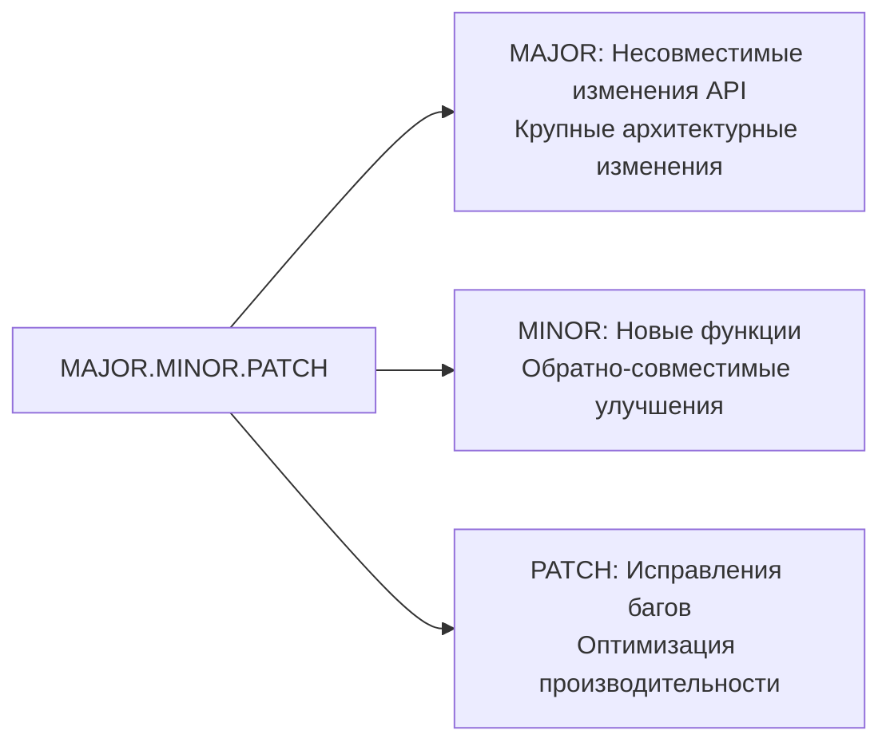
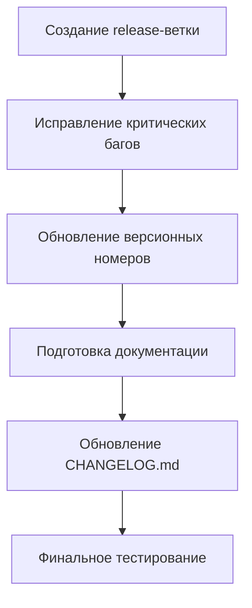
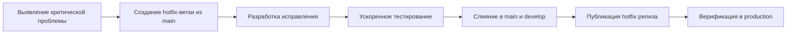

# Процессы и требования формирования выпусков версий

## 1. Общие принципы формирования релизов

### 1.1 Цели и задачи
- **Предсказуемость**: Четкие критерии готовности для каждого релиза
- **Качество**: Обеспечение стабильности и надежности каждого выпуска
- **Прозрачность**: Полная видимость процесса формирования для всех участников
- **Масштабируемость**: Адаптивность процессов под разные типы и сложность релизов

### 1.2 Частота релизов
- **Основные релизы**: Раз в 2 месяца в соответствии с релизным планом
- **Hotfix-релизы**: По требованию для исправления критических проблем
- **Beta/RC-версии**: Для тестирования новых функций с ограниченым кругом пользователей

## 2. Стратегия версионирования

### 2.1 Семантическое версионирование (SemVer 2.0.0)



**Примеры версионирования**:
- `2.0.0` - Полномасштабное обновление архитектуры системы мониторинга
- `1.5.0` - Добавление поддержки Kubernetes метрик
- `1.4.3` - Исправление утечки памяти в агенте сбора данных

### 2.2 Pre-release версии
- **Alpha**: `1.5.0-alpha.1` - Ранние версии для внутреннего тестирования
- **Beta**: `1.5.0-beta.2` - Версии для тестирования ограниченым кругом пользователей
- **Release Candidate**: `1.5.0-rc.1` - Финальная стадия тестирования перед релизом

## 3. Процесс формирования релиза

### 3.1 Подготовительный этап

#### 3.1.1 Планирование содержимого релиза
- Определение эпиков и пользовательских историй для включения в релиз
- Утверждение содержимого с Product Owner и архитектором
- Документирование в релизном плане

#### 3.1.2 Создание release-ветки
```bash
# Пример создания release-ветки
git checkout -b release/v1.5.0 develop
git push origin release/v1.5.0
```

**Требования к release-ветке**:
- Наименование в формате `release/vX.Y.Z`
- Создается только из стабильного состояния ветки `develop`
- Запрещено добавление нового функционала
- Разрешены только исправления багов и документация

### 3.2 Работа над релизом

#### 3.2.1 Финальная подготовка


#### 3.2.2 Критические задачи перед релизом
1. **Обновление версий**:
   - Изменение номера версии во всех конфигурационных файлах
   - Обновление метаданных в сборочных скриптах
   - Версионирование Docker-образов

2. **Подготовка документации**:
   - Обновление CHANGELOG.md с подробным описанием изменений
   - Подготовка Migration Guide при наличии несовместимых изменений
   - Обновление пользовательской документации и примеров

3. **Верификация качества**:
   - Полный прогон автоматизированных тестов
   - Ручное тестирование критических путей
   - Проверка производительности и нагрузочных характеристик

## 4. Требования к релизу

### 4.1 Критерии готовности (Definition of Done для релиза)

#### Обязательные требования:
- [ ] Все запланированные функции реализованы и протестированы
- [ ] Покрытие кода тестами ≥ 70%
- [ ] Отсутствие критических (Critical) и высоких (High) багов
- [ ] Обновлен CHANGELOG.md с детальным описанием изменений
- [ ] Подготовлены Release Notes для пользователей
- [ ] При наличии несовместимых изменений - подготовлен Migration Guide
- [ ] Все автоматизированные тесты проходят успешно
- [ ] Проведено ручное тестирование ключевых сценариев

#### Дополнительные требования для основных релизов:
- [ ] Обновлена документация API
- [ ] Проведено нагрузочное тестирование
- [ ] Проведен security audit
- [ ] Подготовлен план отката

### 4.2 Проверка артефактов релиза

#### Структура релизных артефактов:
```
release-artifacts/
├── monitoring-system-v1.5.0/
│   ├── backend/
│   │   ├── monitoring-api-1.5.0.jar
│   │   └── config/
│   ├── agents/
│   │   ├── linux-agent-v1.5.0
│   │   ├── windows-agent-v1.5.0.exe
│   │   └── kubernetes-exporter-v1.5.0
│   ├── frontend/
│   │   ├── bundle-1.5.0.min.js
│   │   └── styles-1.5.0.min.css
│   └── docs/
│       ├── CHANGELOG.md
│       ├── MIGRATION_GUIDE.md
│       └── RELEASE_NOTES.md
└── signatures/
    ├── GPG_SIGNATURE.asc
    └── CHECKSUMS.sha256
```

#### Требования к артефактам:
- Каждый артефакт должен быть подписан криптографической подписью
- Предоставлены контрольные суммы для верификации целостности
- Артефакты должны содержать метаданные:
  - Версия: 1.5.0
  - Build number: 456 (номер сборки в CI/CD)
  - Git commit hash: abc1234
  - Timestamp: 2025-12-02T14:30:00Z

## 5. Процесс слияния и публикации релиза

### 5.1 Слияние release-ветки

#### В main ветку:
```bash
git checkout main
git merge --no-ff release/v1.5.0
git tag -a v1.5.0 -m "Release version 1.5.0"
git push origin main
git push origin v1.5.0
```

#### В develop ветку (для сохранения исправлений):
```bash
git checkout develop
git merge --no-ff release/v1.5.0
git push origin develop
```

#### Требования к слиянию:
- Требуется минимум 2 утверждающих ревьюера
- Все тесты в CI/CD должны пройти успешно
- Code quality gate должен быть пройден (SonarQube)
- Результаты нагрузочного тестирования должны соответствовать SLO

### 5.2 Публикация артефактов

#### Каналы публикации:
- **Docker Registry**: `monitoring-system:1.5.0`, `monitoring-system:1.5.0-sha-abc1234`
- **Maven Repository** (для Java компонентов): `com.monitoring:api:1.5.0`
- **GitHub Releases**: Официальный релиз с артефактами и Release Notes
- **Helm Chart Repository** (для Kubernetes развертывания)

#### Процесс верификации публикации:
1. Проверка доступности артефактов во всех репозиториях
2. Верификация цифровых подписей
3. Пробное развертывание на staging-среде
4. Финальное утверждение Product Owner

## 6. Hotfix процесс

### 6.1 Критерии для hotfix
- Критическая проблема в production-среде
- Нарушение работы основных бизнес-функций
- Угроза безопасности или потери данных
- Недоступность системы мониторинга более 15 минут

### 6.2 Процедура hotfix



#### Особенности hotfix-процесса:
- **Временные рамки**: От обнаружения проблемы до публикации исправления ≤ 4 часов
- **Тестирование**: Фокус на регрессионное тестирование затронутых компонентов
- **Документирование**: Обязательное описание проблемы и способа ее решения
- **Пост-морти**: Анализ причин возникновения проблемы после устранения

## 7. Ответственность участников

| Роль | Ответственность |
|------|-----------------|
| Product Owner | Утверждение содержимого релиза, приоритизация задач |
| Tech Lead | Общая координация процесса, техническое руководство |
| Release Manager | Организация процесса, контроль выполнения этапов |
| Разработчики | Исправление багов, подготовка кода к релизу |
| QA-инженеры | Финальное тестирование, верификация качества |
| DevOps | Подготовка инфраструктуры, автоматизация публикации |

---

*Документ обновляется в соответствии с изменениями в процессе формирования релизов. Последнее обновление: 02.12.2025*
