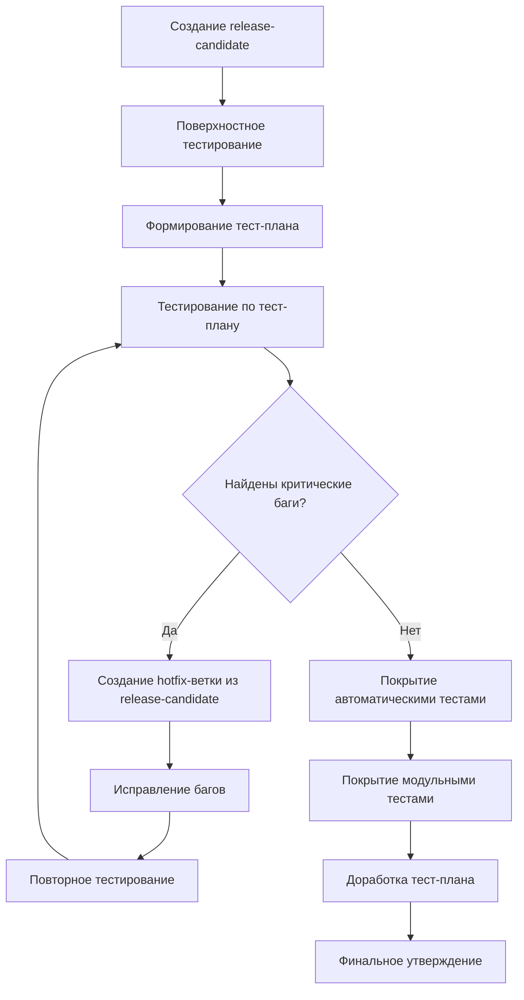

# Процессы и требования формирования выпусков версий

## 1. Общие принципы формирования релизов

### 1.1 Цели и задачи
- **Предсказуемость**: Четкие критерии готовности для каждого релиза
- **Качество**: Обеспечение стабильности и надежности каждого выпуска
- **Прозрачность**: Полная видимость процесса формирования для всех участников
- **Масштабируемость**: Адаптивность процессов под разные типы и сложность релизов
- **Соответствие архитектуре**: Взаимосвязь версий с иерархией веток в системе контроля версий

## 2. Процесс формирования релиза

### 2.1 Подготовительный этап

#### 2.1.1 Планирование содержимого релиза
- Определение эпиков и пользовательских историй для включения в релиз
- Утверждение содержимого с Product Owner и архитектором
- Документирование в релизном плане с указанием Feature Type для каждой задачи
- Расчет версии релиза на основе количества и типов изменений

#### 3.1.2 Создание release-candidate-ветки
```bash
# Пример создания release-candidate ветки
git checkout -b release-candidate/v1.1.0 develop
git push origin release-candidate/v1.1.0
```

**Требования к release-candidate ветке**:
- Наименование в формате `release-candidate/vX.Y.Z`
- Создается только из стабильного состояния ветки `develop`
- Запрещено добавление нового функционала
- Разрешены только исправления багов и обновление документации

### 3.2 Работа над релизом

#### 3.2.1 Процесс тестирования Release Candidate


#### 3.2.2 Финальная подготовка
1. **Обновление версий**:
   - Изменение номера версии во всех конфигурационных файлах
   - Обновление метаданных в сборочных скриптах
   - Версионирование Docker-образов

2. **Подготовка документации**:
   - Обновление CHANGELOG.md с подробным описанием изменений
   - Подготовка Migration Guide при наличии несовместимых изменений
   - Обновление пользовательской документации и примеров

3. **Верификация качества**:
   - Генерация автоматического тест-плана перед сборкой
   - Отправка email-уведомления с тест-планом участникам команды
   - Сравнение списка задач с предыдущим успешным билдом

## 4. Требования к релизу

### 4.1 Критерии готовности (Definition of Done для релиза)

#### Обязательные требования:
- [ ] Все запланированные функции реализованы и протестированы
- [ ] Покрытие кода тестами ≥ 70%
- [ ] Отсутствие критических (Critical) и высоких (High) багов
- [ ] Обновлен CHANGELOG.md с детальным описанием изменений
- [ ] Подготовлены Release Notes для пользователей
- [ ] При наличии несовместимых изменений - подготовлен Migration Guide
- [ ] Все автоматизированные тесты проходят успешно
- [ ] Сформирован и утвержден финальный тест-план

#### Процесс обработки багов, найденных при тестировании RC:
- Если баг критический и воспроизводится в продакшене - создается задача через внешний проект поддержки
- Если баг относится к As Designed, Cannot Reproduce или Duplicate - закрывается с соответствующей пометкой в поле "Reason"
- Для исправления багов в RC создается отдельная hotfix-ветка из release-candidate

## 6. Hotfix процесс

### 6.1 Критерии для hotfix
- Критическая проблема в production-среде
- Нарушение работы основных бизнес-функций
- Угроза безопасности или потери данных
- Недоступность системы мониторинга более 15 минут
- Проблема воспроизводится в продакшене и подтверждена командой поддержки

### 6.2 Процедура hotfix


#### Особенности hotfix-процесса:
- **Временные рамки**: От обнаружения проблемы до публикации исправления ≤ 4 часов
- **Создание задачи на мерж**: Обязательное создание задачи в трекере с типом активности "Merge"
- **Тестирование**: Фокус на регрессионное тестирование затронутых компонентов
- **Документирование**: Обязательное описание проблемы и способа ее решения
- **Пост-морти**: Анализ причин возникновения проблемы после устранения с участием архитектора

## 7. Процесс обновления версий в системе

### 7.1 Автоматическое обновление версий
- При переходе задачи в статус "Done" обновляется только минорная версия ветки
- При слиянии дочерней ветки в родительскую обновляется версия родительской ветки
- Система отслеживает изменения через ассоциацию коммитов с work items

### 7.2 Обработка ошибок при обновлении версий
- При ошибках создается запись в таблице ошибок системы управления версиями
- Задача помечается полем "Blocked" = "Yes"
- После устранения ошибок необходимо обновить и снять блокировку задачи
- Ключевые поля для отслеживания:
  - "Changesets" - для задач на обновление версии
  - "Updated" - для подтверждения успешного обновления

---

*Документ обновляется в соответствии с изменениями в процессе формирования релизов. Последнее обновление: 02.12.2025*
