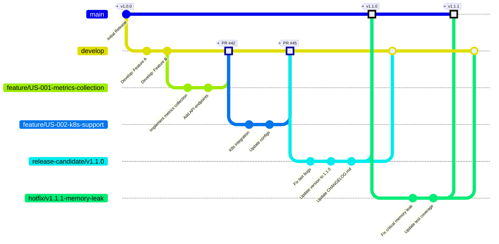
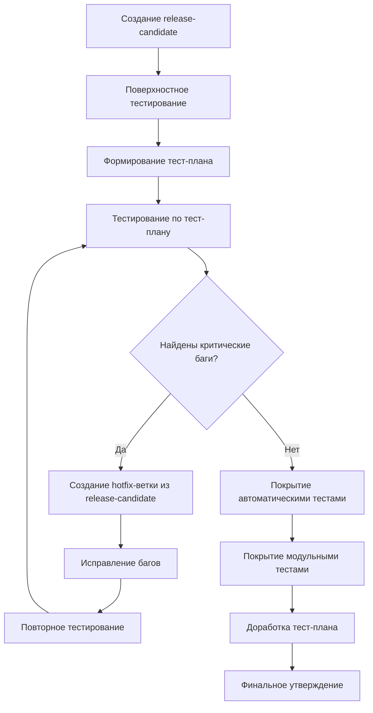

# Процессы и требования формирования выпусков версий

## 1. Общие принципы формирования релизов

### 1.1 Цели и задачи
- **Предсказуемость**: Четкие критерии готовности для каждого релиза
- **Качество**: Обеспечение стабильности и надежности каждого выпуска
- **Прозрачность**: Полная видимость процесса формирования для всех участников
- **Масштабируемость**: Адаптивность процессов под разные типы и сложность релизов
- **Соответствие архитектуре**: Взаимосвязь версий с иерархией веток в системе контроля версий

### 1.2 Частота релизов
- **Основные релизы**: Раз в 2 месяца в соответствии с релизным планом
- **Hotfix-релизы**: По требованию для исправления критических проблем
- **Release Candidate (RC)**: Версии для тестирования перед финальным релизом

## 2. Стратегия версионирования и иерархия веток

### 2.1 Структура веток в системе контроля версий


### 2.2 Описание веток
- **main**: Главная ветка, содержащая код для продакшена. Защищенная ветка доступна только для слияния с ветками release-candidate и hotfix.
- **develop**: Ветка подготовки следующего релиза. Все feature-ветки сливаются именно сюда.
- **release-candidate/*:** Ветка для финального тестирования перед выпуском. Создается из develop и содержит только исправления багов, не добавляется новый функционал.
- **feature/*:** Ветки для разработки отдельных функций в соответствии с пользовательскими историями.
- **hotfix/*:** Ветки для срочного исправления критических проблем в продакшене.

### 2.3 Система версионирования
Формат версии: `MAJOR.MINOR.PATCH.BUILD`
- **MAJOR**: Количество глобальных (архитектурных) изменений
- **MINOR**: Количество модулей в системе
- **PATCH**: Количество функциональных изменений
- **BUILD**: Номер последнего changeset'а в системе контроля версий

**Примеры версионирования**:
- `2.3.5.4512` - Вторая мажорная версия, 3 модуля в системе, 5 функциональных изменений, сборка №4512

### 2.4 Классификация Feature-веток по типам
При создании новой feature-ветки обязательно указывается тип функциональности:

| Тип | Описание | Начальная версия | Ответственный |
|-----|----------|------------------|--------------|
| Architectural | Функциональность вносит архитектурные изменения | 1.0.0 | Главный архитектор |
| Module | Функциональность представляет новый модуль системы | 0.1.0 | Tech Lead |
| Improvement | Функциональность вносит мелкие правки без влияния на основные моменты работы | 0.0.0 | Разработчик |

## 3. Процесс формирования релиза

### 3.1 Подготовительный этап

#### 3.1.1 Планирование содержимого релиза
- Определение эпиков и пользовательских историй для включения в релиз
- Утверждение содержимого с Product Owner и архитектором
- Документирование в релизном плане с указанием Feature Type для каждой задачи
- Расчет версии релиза на основе количества и типов изменений

#### 3.1.2 Создание release-candidate-ветки
```bash
# Пример создания release-candidate ветки
git checkout -b release-candidate/v1.1.0 develop
git push origin release-candidate/v1.1.0
```

**Требования к release-candidate ветке**:
- Наименование в формате `release-candidate/vX.Y.Z`
- Создается только из стабильного состояния ветки `develop`
- Запрещено добавление нового функционала
- Разрешены только исправления багов и обновление документации

### 3.2 Работа над релизом

#### 3.2.1 Процесс тестирования Release Candidate


#### 3.2.2 Финальная подготовка
1. **Обновление версий**:
   - Изменение номера версии во всех конфигурационных файлах
   - Обновление метаданных в сборочных скриптах
   - Версионирование Docker-образов

2. **Подготовка документации**:
   - Обновление CHANGELOG.md с подробным описанием изменений
   - Подготовка Migration Guide при наличии несовместимых изменений
   - Обновление пользовательской документации и примеров

3. **Верификация качества**:
   - Генерация автоматического тест-плана перед сборкой
   - Отправка email-уведомления с тест-планом участникам команды
   - Сравнение списка задач с предыдущим успешным билдом

## 4. Требования к релизу

### 4.1 Критерии готовности (Definition of Done для релиза)

#### Обязательные требования:
- [ ] Все запланированные функции реализованы и протестированы
- [ ] Покрытие кода тестами ≥ 70%
- [ ] Отсутствие критических (Critical) и высоких (High) багов
- [ ] Обновлен CHANGELOG.md с детальным описанием изменений
- [ ] Подготовлены Release Notes для пользователей
- [ ] При наличии несовместимых изменений - подготовлен Migration Guide
- [ ] Все автоматизированные тесты проходят успешно
- [ ] Сформирован и утвержден финальный тест-план

#### Процесс обработки багов, найденных при тестировании RC:
- Если баг критический и воспроизводится в продакшене - создается задача через внешний проект поддержки
- Если баг относится к As Designed, Cannot Reproduce или Duplicate - закрывается с соответствующей пометкой в поле "Reason"
- Для исправления багов в RC создается отдельная hotfix-ветка из release-candidate

### 4.2 Проверка артефактов релиза

#### Структура релизных артефактов:
```
release-artifacts/
├── monitoring-system-v1.1.0/
│   ├── backend/
│   │   ├── monitoring-api-1.1.0.jar
│   │   └── config/
│   ├── agents/
│   │   ├── linux-agent-v1.1.0
│   │   ├── windows-agent-v1.1.0.exe
│   │   └── kubernetes-exporter-v1.1.0
│   ├── frontend/
│   │   ├── bundle-1.1.0.min.js
│   │   └── styles-1.1.0.min.css
│   └── docs/
│       ├── CHANGELOG.md
│       ├── MIGRATION_GUIDE.md
│       └── RELEASE_NOTES.md
└── metadata/
    ├── VERSION.txt (содержит полную версию 1.1.0.4512)
    ├── BUILD_INFO.json (информация о сборке)
    └── CHANGES_SINCE_LAST_BUILD.md
```

#### Требования к артефактам:
- Каждый артефакт должен содержать метаданные:
  - Версия: MAJOR.MINOR.PATCH.BUILD
  - Build number: 4512 (номер сборки в CI/CD)
  - Git commit hash: abc1234
  - Timestamp: 2025-12-02T14:30:00Z
- Генерация ReleaseNotes при автоматической выкладке на тестовый сервер
- Автоматическая рассылка email с ReleaseNotes участника проекта

## 5. Процесс слияния и публикации релиза

### 5.1 Слияние release-candidate ветки

#### В main ветку:
```bash
git checkout main
git merge --no-ff release-candidate/v1.1.0 -m "Merge release-candidate/v1.1.0 to main"
git tag -a v1.1.0.4512 -m "Release version 1.1.0.4512"
git push origin main
git push origin v1.1.0.4512
```

#### В develop ветку (для сохранения исправлений):
```bash
git checkout develop
git merge --no-ff release-candidate/v1.1.0 -m "Merge release-candidate/v1.1.0 to develop"
git push origin develop
```

#### Требования к слиянию:
- Обязательная ассоциация слияния с задачей на мерж в трекере
- Комментарий к слиянию в формате: "Merge from release-candidate/v1.1.0 to main"
- Минимум 2 утверждающих ревьюера для основных релизов
- Все тесты в CI/CD должны пройти успешно
- Code quality gate должен быть пройден (SonarQube)
- При слиянии баз данных использования SNAP-файлов с проверкой на целевой БД

### 5.2 Особые ситуации при слиянии

#### Слияние двух feature-веток для тестирования:
```bash
# Пример слияния feature/US-002-k8s-support в feature/US-001-metrics-collection для совместного тестирования
git checkout feature/US-001-metrics-collection
git merge feature/US-002-k8s-support -m "Merge feature/US-002-k8s-support for joint testing"
```
- При слиянии двух feature-веток для совместного тестирования создается отдельная задача на мерж
- После тестирования ветки разделяются, а критические исправления переносятся обратно в обе ветки
- **Важно**: Такая ситуация должна быть минимизирована, так как усложняет отслеживание изменений

#### Замена одной функциональности на другую:
- При замене на тестировании одной функциональности на другую необходимо перетереть код и БД на тестовом сервере
- Эта ситуация является исключительной и должна быть одобрена архитектором
- Обязательно резервное копирование перед заменой
- **Рекомендация**: Избегать подобных ситуаций любыми способами

### 5.3 Публикация артефактов

#### Каналы публикации:
- **Docker Registry**: `monitoring-system:1.1.0.4512`, `monitoring-system:1.1.0-sha-abc1234`
- **Maven Repository** (для Java компонентов): `com.monitoring:api:1.1.0.4512`
- **GitHub Releases**: Официальный релиз с артефактами и Release Notes
- **Helm Chart Repository** (для Kubernetes развертывания)

#### Процесс верификации публикации:
1. Проверка доступности артефактов во всех репозиториях
2. Автоматическая генерация и рассылка ReleaseNotes
3. Пробное развертывание на staging-среде
4. Финальное утверждение Product Owner
5. Обновление записи в системе управления версиями

## 6. Hotfix процесс

### 6.1 Критерии для hotfix
- Критическая проблема в production-среде
- Нарушение работы основных бизнес-функций
- Угроза безопасности или потери данных
- Недоступность системы мониторинга более 15 минут
- Проблема воспроизводится в продакшене и подтверждена командой поддержки

### 6.2 Процедура hotfix

```mermaid
flowchart LR
    A[Выявление критической проблемы] --> B[Подтверждение командой поддержки]
    B --> C[Создание hotfix-ветки из main]
    C --> D[Разработка исправления]
    D --> E[Ускоренное тестирование]
    E --> F[Создание задачи на мерж]
    F --> G[Слияние в main и develop]
    G --> H[Публикация hotfix релиза]
    H --> I[Верификация в production]
    I --> J[Анализ причин проблемы]
```



#### Особенности hotfix-процесса:
- **Временные рамки**: От обнаружения проблемы до публикации исправления ≤ 4 часов
- **Создание задачи на мерж**: Обязательное создание задачи в трекере с типом активности "Merge"
- **Тестирование**: Фокус на регрессионное тестирование затронутых компонентов
- **Документирование**: Обязательное описание проблемы и способа ее решения
- **Пост-морти**: Анализ причин возникновения проблемы после устранения с участием архитектора

## 7. Процесс обновления версий в системе

### 7.1 Автоматическое обновление версий
- При переходе задачи в статус "Done" обновляется только минорная версия ветки
- При слиянии дочерней ветки в родительскую обновляется версия родительской ветки
- Система отслеживает изменения через ассоциацию коммитов с work items

### 7.2 Обработка ошибок при обновлении версий
- При ошибках создается запись в таблице ошибок системы управления версиями
- Задача помечается полем "Blocked" = "Yes"
- После устранения ошибок необходимо обновить и снять блокировку задачи
- Ключевые поля для отслеживания:
  - "Changesets" - для задач на обновление версии
  - "Updated" - для подтверждения успешного обновления

## 8. Ответственность участников

| Роль | Ответственность |
|------|-----------------|
| Product Owner | Утверждение содержимого релиза, приоритизация задач, финальное одобрение Release Candidate |
| Главный архитектор | Определение Feature Type для архитектурных изменений, утверждение мержа критических компонентов |
| Tech Lead | Общая координация процесса, техническое руководство, контроль качества кода |
| Release Manager | Организация процесса, контроль выполнения этапов, управление версиями в системе |
| Разработчики | Исправление багов, подготовка кода к релизу, создание задач на мерж |
| QA-инженеры | Формирование и выполнение тест-планов, верификация качества, работа с багами |
| DevOps | Подготовка инфраструктуры, автоматизация публикации, настройка CI/CD для версионирования |

---

*Документ обновляется в соответствии с изменениями в процессе формирования релизов. Последнее обновление: 02.12.2025*