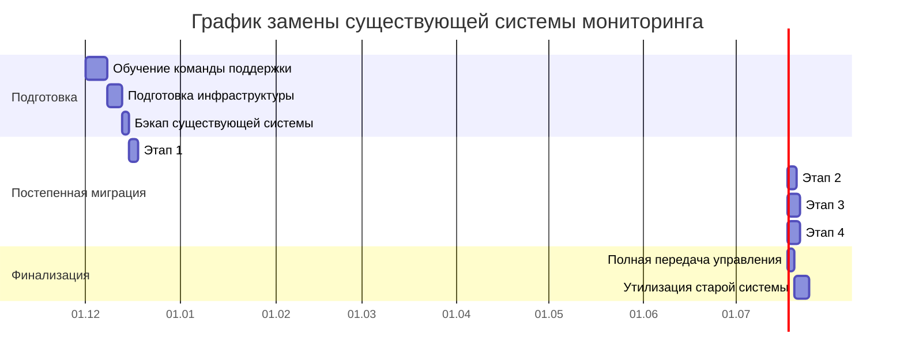
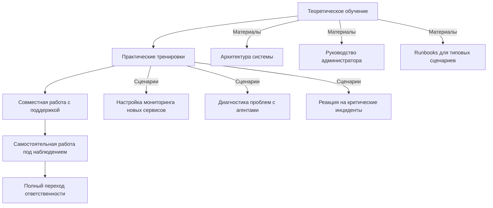
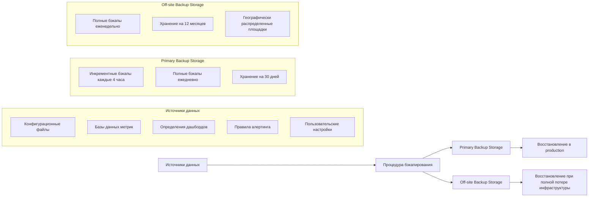
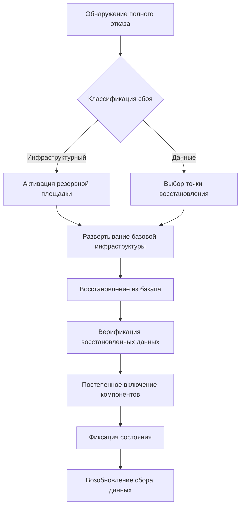
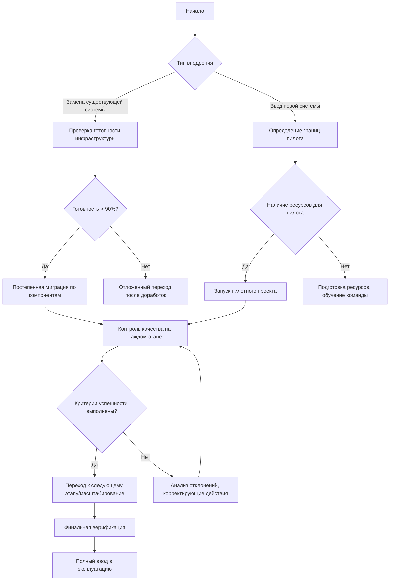

# Описание процедуры ввода в эксплуатацию

## 1. Общие принципы ввода в эксплуатацию

### 1.1 Цели процедуры
- **Минимизация downtime**: Обеспечение непрерывности работы системы мониторинга
- **Контролируемость**: Пошаговое внедрение с возможностью отката
- **Верифицируемость**: Проверка работоспособности на каждом этапе
- **Безопасность**: Сохранение целостности данных и конфиденциальной информации

### 1.2 Предварительные условия
- Утверждение релиза Product Owner
- Полная верификация артефактов в staging-среде
- Наличие актуального откат-плана
- Уведомление заинтересованных сторон за 24 часа до развертывания
- Подготовка команды поддержки к возможным инцидентам
- Наличие полной процедуры бэкапирования (согласно разделу 4)

## 2. Вариант 1: Замена существующей системы мониторинга

### 2.1 Особенности сценария
Данный вариант применяется при миграции с устаревшей системы мониторинга на новую архитектуру. Требуется сохранение исторических данных и обеспечение бесперебойного сбора метрик в процессе миграции.

### 2.2 Периодичность и этапы миграции


### 2.3 Контроль качества запуска системы

#### Предварительная верификация:
- **Тестирование на staging-среде** с использованием production-like данных
- **Нагрузочное тестирование** с имитацией пиковой нагрузки (150% от нормальной)
- **Проверка восстановления после сбоев** (тестирование аварийных сценариев)

#### Контрольные точки во время миграции:
1. **Сбор данных**:
   - Сравнение метрик новой и старой систем (расхождение ≤ 2%)
   - Проверка полноты сбора данных (отсутствие пропусков)
   - Верификация точности агрегированных показателей

2. **Обработка и визуализация**:
   - Скорость формирования отчетов (≤ 3 сек для стандартных дашбордов)
   - Точность отображения данных (сравнение с эталонными значениями)
   - Производительность при работе с историческими данными

3. **Оповещения и инциденты**:
   - Тестирование сценариев срабатывания алертов
   - Проверка корректности доставки уведомлений
   - Верификация интеграции с системами управления инцидентами

### 2.4 Планирование обучения

#### Этапы обучения:


#### Роли и ответственные:
| Группа пользователей | Количество человек | Продолжительность обучения | Ответственный за обучение |
|----------------------|-------------------|----------------------------|---------------------------|
| Администраторы системы | 3-5 | 5 дней | Главный архитектор |
| Инженеры SRE | 8-10 | 3 дня | Tech Lead |
| Операционная поддержка | 15-20 | 2 дня | Старший инженер поддержки |
| Аналитики данных | 5-7 | 1 день | Product Owner |

## 3. Вариант 2: Ввод в эксплуатацию новой системы мониторинга

### 3.1 Особенности сценария
Данный вариант применяется при внедрении системы мониторинга в организацию, где ранее не было централизованной системы. Используется пилотный режим для постепенного охвата всех компонентов инфраструктуры.

### 3.2 Пилотный режим ввода в эксплуатацию

#### 3.2.1 Структура пилотного проекта
- **Длительность**: 4-6 недель
- **Границы пилота**:
  - Выделенные серверы (не более 20% от общей инфраструктуры)
  - Ограниченные типы метрик (CPU, RAM, Disk, Network)
  - Конкретный географический регион или бизнес-направление
- **Команда пилота**:
  - 2-3 инженера из команды разработки
  - 1 представитель от бизнеса
  - 1 представитель от операционной поддержки

#### 3.2.2 Этапы пилотного режима
```mermaid
journey
    title Этапы пилотного режима
    section Неделя 1-2: Подготовка
      Развертывание на пилотных серверах: 5: DevOps
      Настройка базовых метрик: 3: DevOps
      Обучение команды пилота: 4: Tech Lead
    section Неделя 3-4: Эксплуатация
      Ежедневный сбор обратной связи: 8: Все участники
      Еженедельные ретроспективы: 2: Scrum Master
      Корректировка конфигурации: 3: DevOps
    section Неделя 5-6: Оценка
      Анализ эффективности: 5: Product Owner
      Сбор требований для улучшений: 6: Все участники
      Подготовка плана масштабирования: 4: Tech Lead
```

#### 3.2.3 Критерии успешности пилота
- **Технические критерии**:
  - 99.5% uptime системы мониторинга
  - Средняя задержка сбора данных ≤ 30 секунд
  - Отсутствие потери данных при перезагрузке компонентов
  - Время восстановления после сбоя ≤ 5 минут

- **Бизнес-критерии**:
  - Сокращение времени обнаружения инцидентов на 30%
  - Положительная обратная связь от 80% пользователей пилота
  - Сокращение ручных операций по проверке состояния систем на 50%
  - Экономия времени на анализ инцидентов не менее чем на 25%

### 3.3 Процедура масштабирования после пилота
1. **Анализ результатов пилота**:
   - Сбор и систематизация всех полученных данных
   - Документирование выявленных проблем и улучшений
   - Корректировка плана полного внедрения

2. **Подготовка к масштабированию**:
   - Обновление архитектуры с учетом результатов пилота
   - Расширение инфраструктуры для поддержки полной нагрузки
   - Обучение полной команды поддержки

3. **Поэтапное расширение**:
   - Неделя 1-2: Расширение на 30% инфраструктуры
   - Неделя 3-4: Расширение на 60% инфраструктуры
   - Неделя 5-6: Полное покрытие 100% инфраструктуры

## 4. Процедура бэкапирования данных

### 4.1 Принципы бэкапирования
Бэкапирование в контексте системы мониторинга отличается от стандартного резервного копирования и включает:

- **Фиксация состояния системы** перед критическими операциями
- **Сохранение конфигурации** всех компонентов (агентов, серверов, дашбордов)
- **Архивирование исторических данных** с контролем целостности
- **Фиксация зависимостей** между компонентами системы

### 4.2 Схема бэкапирования



### 4.3 Процедура выполнения бэкапа
1. **Подготовка**:
   ```bash
   # Остановка некритичных компонентов для обеспечения консистентности
   kubectl scale deployment monitoring-api --replicas=0
   kubectl scale statefulset metrics-database --replicas=1
   ```

2. **Создание снапшотов**:
   - Снапшот баз данных (TimescaleDB, ClickHouse)
   - Экспорт конфигурации агентов сбора
   - Экспорт определений дашбордов и правил алертинга
   - Фиксация версий всех компонентов системы

3. **Верификация целостности**:
   ```python
   # Пример проверки целостности бэкапа
   def verify_backup_integrity(backup_path):
       # Проверка контрольных сумм
       validate_checksums(backup_path)
       # Проверка восстановления метаданных
       restore_metadata_test(backup_path)
       # Проверка доступности всех компонентов бэкапа
       check_components_availability(backup_path)
       return True
   ```

4. **Архивирование**:
   - Шифрование архивов перед сохранением
   - Подписание цифровой подписью для верификации
   - Распределение по нескольким географическим площадкам

## 5. Аварийное восстановление при полном отказе системы

### 5.1 Сценарии полного отказа
- Потеря основной инфраструктуры (data center)
- Критическая ошибка в данных, делающая их непригодными
- Компрометация безопасности с полной утратой доверия к данным
- Сбой, требующий полного восстановления из бэкапа

### 5.2 Процедура аварийного восстановления



### 5.3 Процесс принятия решений

#### Триггеры для активации процедуры:
- **Автоматические**:
  - Отказ 100% инстансов основных сервисов более чем на 30 минут
  - Потеря доступа к данным более чем за последние 24 часа
  - Нарушение контрольных сумм более чем 50% данных

- **Ручные** (требуют подтверждения):
  - Решение технического директора при угрозе безопасности
  - Коллективное решение команды SRE при невозможности локализовать проблему > 1 час
  - Запрос от бизнеса при критическом воздействии на операционную деятельность

#### Уровни утверждения аварийного восстановления:
1. **Уровень 1** (локальные компоненты):
   - Ответственный: DevOps инженер
   - Время принятия решения: ≤ 15 минут
   - Зона ответственности: Отдельные сервисы или компоненты

2. **Уровень 2** (частичный отказ):
   - Ответственный: Tech Lead + Product Owner
   - Время принятия решения: ≤ 30 минут
   - Зона ответственности: Несколько связанных компонентов

3. **Уровень 3** (полный отказ):
   - Ответственный: Технический директор + CIO
   - Время принятия решения: ≤ 1 час
   - Зона ответственности: Вся система мониторинга

### 5.4 Средства фиксации и восстановления элементов в период простоя

#### 5.4.1 Фиксация промежуточных данных
- **Буферизация на агентах**:
  - Агенты сбора сохраняют данные локально при недоступности сервера
  - Механизм ротации файлов для предотвращения переполнения
  - Приоритизация критических метрик при ограниченном пространстве

- **Распределенное кэширование**:
  ```python
  class DistributedFallbackCache:
      def __init__(self):
          # Множество узлов кэширования для отказоустойчивости
          self.cache_nodes = ['node1', 'node2', 'node3']
          
      def store_metrics(self, metrics):
          # Хэширование для распределения нагрузки
          node = hash(metrics.source) % len(self.cache_nodes)
          self._send_to_node(node, metrics)
          
      def _send_to_node(self, node_id, data):
          try:
              # Попытка отправки с экспоненциальной задержкой при ошибке
              self._retry_with_backoff(
                  lambda: requests.post(f"http://{self.cache_nodes[node_id]}/cache", json=data)
              )
          except Exception as e:
              # Локальное сохранение при невозможности отправки
              self._save_locally(data)
  ```

#### 5.4.2 Процедура восстановления данных после простоя
1. **Оценка состояния**:
   - Анализ доступных буферов у агентов
   - Проверка целостности сохраненных данных
   - Определение временных окон пропущенных данных

2. **Приоритизация восстановления**:
   ```mermaid
   pie
       title Приоритеты восстановления данных
       "Критические бизнес-метрики" : 35
       "Системные метрики инфраструктуры" : 30
       "Метрики приложений" : 20
       "Дополнительные метрики" : 15
   ```

3. **Поэтапное восстановление**:
   - **Фаза 1 (0-30 мин)**: Восстановление системы сбора и базовой инфраструктуры
   - **Фаза 2 (30-120 мин)**: Загрузка наиболее критичных метрик из буферов агентов
   - **Фаза 3 (2-24 часа)**: Постепенное восстановление исторических данных
   - **Фаза 4 (24+ часа)**: Полное восстановление и нормализация работы системы

4. **Механизмы минимизации потерь**:
   - Восстановление из локальных буферов агентов (до 72 часов данных)
   - Использование прокси-метрик для заполнения пробелов (интерполяция)
   - Приоритетная обработка данных с высокой бизнес-ценностью
   - Сжатие менее критичных данных для экономии ресурсов при восстановлении

## 6. Выбор стратегии ввода в эксплуатацию



**Критерии выбора стратегии**:

- **Замена существующей системы** при:
  - Наличии работающей системы мониторинга с данными
  - Требовании бесперебойной работы без потери истории
  - Необходимости плавного перехода пользователей
  - Существовании зависимостей в интеграциях с другими системами

- **Ввод новой системы** при:
  - Отсутствии централизованной системы мониторинга
  - Возможности начать с ограниченного пилота
  - Высокой степени неопределенности требований
  - Необходимости накопления опыта перед полномасштабным внедрением

---

*Документ обновляется в соответствии с изменениями в процессе ввода системы в эксплуатацию. Последнее обновление: 02.12.2025*