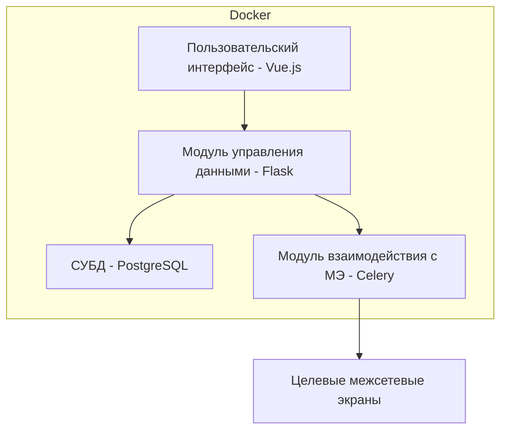

# Описание проекта
Проект представляет собой программное обеспечение, обеспечивающее централизованное управление межсетевыми экранами (МЭ). Основной функционал включает: 
- хранение учетных данных доступа МЭ, 
- настройку конфигураций МЭ, 
- контроль доступа пользователей через модель ограничения прав,
- модульная совместимость с различными реализациями МЭ. 

Система состоит из модулей пользовательского интерфейса, управления данными и интеграции с целевыми МЭ, реализованных на стеке Flask, Vue.js, PostgreSQL и Docker для обеспечения мультиплатформенности и масштабируемости.

